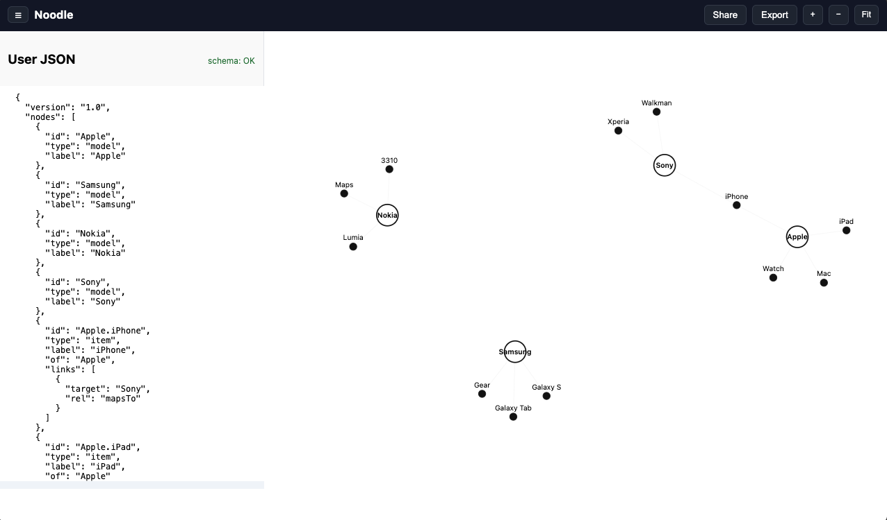

# Noodle

Interactive JSON-to-Graph visualizer and editor built with D3.js.

 <!-- İstersen ekran görüntüsü ekleyebilirsin -->

## Features

- **Visualize JSON as a graph**  
  Models (white nodes) and their items (black nodes) are displayed.
- **Drag & Drop relationships**  
  Create edges by dragging an item onto a model; arrows are drawn automatically.
- **Live JSON editor & validation**  
  Left sidebar contains the underlying JSON; changes are reflected in the graph.
- **Schema validation**  
  JSON is checked against a schema (valid/invalid status shown).
- **Export as edge triples**  
  Export the graph as subject–predicate–object triples for AI / RAG pipelines.
- **Zoom & Pan**  
  - Hold `Space` to pan (hand cursor).  
  - Hold `Alt/Option` + scroll to zoom in/out.  
  - Use header buttons (+ / – / Fit) to control view.
- **Sidebar toggle**  
  Collapse/expand sidebar with ☰ button in header.

## Getting Started

### Run locally

```bash
git clone https://github.com/<your-username>/noodle.git
cd noodle
open index.html   # or just double-click in Finder/Explorer
```

No build step is required; everything runs directly in the browser.

### Editing

- Edit `index.html` for code.
- JSON data lives in the left sidebar editor; can be updated live.

## Usage

1. Start with the default JSON structure.
2. Drag items to models to create new mappings.
3. Watch edges update in the graph and JSON.
4. Export triples via the **Export** button.

Example triple output:

```json
{
  "triples": [
    { "s": "Apple.iPhone", "p": "mapsTo", "o": "Sony" },
    { "s": "Apple.iPad",   "p": "mapsTo", "o": "Samsung" },
    { "s": "Apple.iPhone", "p": "belongsTo", "o": "Apple" }
  ]
}
```

## Roadmap

- [ ] Edge deletion support  
- [ ] Curved edges for readability  
- [ ] Import multiple JSON files  
- [ ] Save/load graph state

## License

MIT